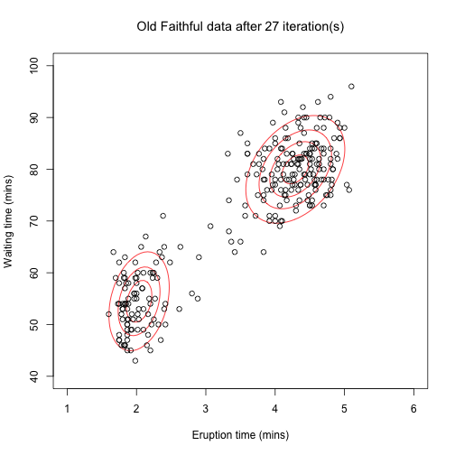

## EM clustering

Recently, I found out about expectation-maximisation algorithm, and was fascinated with how easily it could be understood. This project is a demo of clustering data with this algorithm.

Data used is Old Faitful geyser eruption data. When initial variables are set, algorithm converges in set number of iterations.

EM here was done using `mvtnorm` library, to fit data to multivariate normal distributions.

Final shiny app could be found [HERE](https://duxan.shinyapps.io/Data_products_EM_example/)

--- 

**Initialising**: User should first provide initialising data for both clusters, which will produce (reload) first plot, like here too

---

**Iterations**: After that user can set how many iterations algorithm should run, which updates second plot, like here too (27 iterations set, for previous initialising data)

---

Shiny app: [duxan.shinyapps.io](https://duxan.shinyapps.io/Data_products_EM_example/)  

THIS CODE GITHUB: [github.com/duxan](https://github.com/duxan/data-products-assignment-slidify)

## Thank you!

